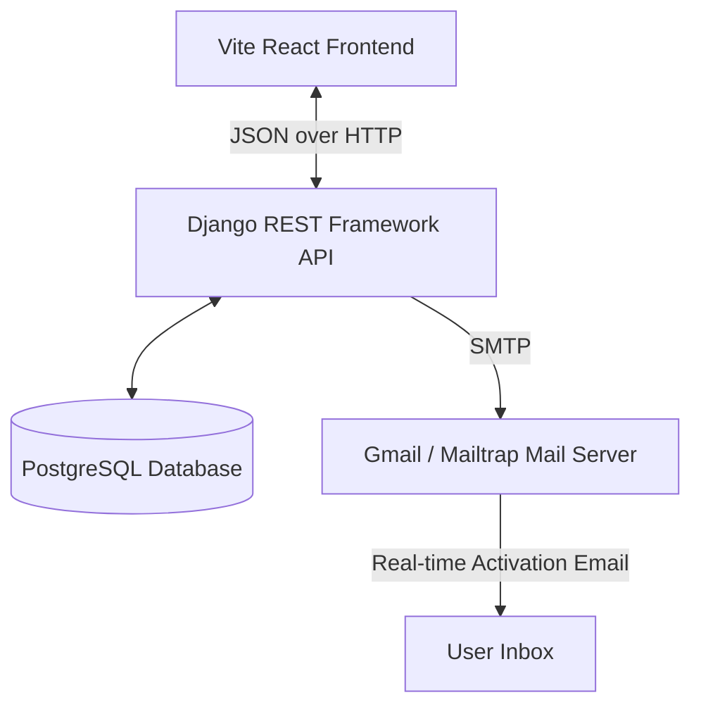

# ZenTask - Modern Task Manager with Real-time Email Verification

ZenTask is a premium, modern task management application featuring a glassmorphism design, category management, task prioritization, due dates, and a robust real-time email verification workflow during user registration.

---

## 🏗️ Project Architecture & Tech Stack

The project is split into a separated frontend and backend structure:

- **Frontend**: React (Vite), React Router DOM, Axios for API communication, and Bootstrap 5 for modern, responsive layouts.
- **Backend**: Django 5, Django REST Framework (DRF), SimpleJWT (JSON Web Tokens), PostgreSQL database, and Python SMTP email integrations.



---

## ✨ Features

- **User Authentication**: Secure JWT-based registration, login, and profile fetching.
- **Real-Time Email Verification**: User registration creates an inactive account and sends an activation link via SMTP. Clicking the link activates the account.
- **Task Management (CRUD)**: Create, read, update, and delete tasks.
- **Task Prioritization**: Support for Priority levels (Low, Medium, High).
- **Categories**: Organize tasks into user-specific categories.
- **Responsive Theme**: Modern glassmorphism UI with responsive design.

---

## 🚀 Setup & Installation

### Prerequisites
- Python 3.10+
- Node.js 18+
- PostgreSQL database running locally

---

### 1. Backend Setup (`task_manager_backend`)

1. **Navigate to the backend directory**:
   ```bash
   cd task_manager_backend
   ```

2. **Create and activate the Python virtual environment**:
   ```bash
   # On Windows
   python -m venv venv
   .\venv\Scripts\activate
   ```

3. **Install dependencies**:
   ```bash
   pip install -r requirements.txt
   ```

4. **Configure Environment Variables**:
   Create a `.env` file in the `task_manager_backend/` folder (or edit the existing one) with the following content:
   ```ini
   # Django Core Settings
   SECRET_KEY=your-django-secret-key
   DEBUG=True

   # Database configuration
   DB_NAME=task_manager
   DB_USER=postgres
   DB_PASSWORD=your-db-password
   DB_HOST=localhost
   DB_PORT=5432

   # Email SMTP configuration (Option 1: Gmail SMTP)
   EMAIL_BACKEND=django.core.mail.backends.smtp.EmailBackend
   EMAIL_HOST=smtp.gmail.com
   EMAIL_PORT=587
   EMAIL_USE_TLS=True
   EMAIL_HOST_USER=your-email@gmail.com
   EMAIL_HOST_PASSWORD=your-16-digit-app-password
   DEFAULT_FROM_EMAIL=your-email@gmail.com

   # Frontend activation link base URL
   FRONTEND_URL=http://localhost:5173
   ```

5. **Run database migrations**:
   ```bash
   python manage.py migrate
   ```

6. **Start the Django development server**:
   ```bash
   python manage.py runserver
   ```
   The backend will start running on `http://127.0.0.1:8000/`.

7. **Run backend tests**:
   ```bash
   python manage.py test
   ```

---

### 2. Frontend Setup (`task-manager_frontend`)

1. **Navigate to the frontend directory**:
   ```bash
   cd task-manager_frontend
   ```

2. **Install Node dependencies**:
   ```bash
   npm install
   ```

3. **Run the Vite development server**:
   ```bash
   npm run dev
   ```
   The frontend will start running on `http://localhost:5173/`.

---

## 📧 Email Verification Flow Detail

When a user signs up on the registration page:
1. The frontend POSTs `username`, `password`, and `email` to `/api/register/`.
2. The backend creates the user with `is_active=False` so they cannot log in immediately.
3. The backend generates a secure base64-encoded user ID (`uid`) and a one-time cryptographic token (`token`).
4. The backend constructs a verification link: `{FRONTEND_URL}/verify-email?uid={uid}&token={token}`.
5. The activation link is sent to the user's email address via Gmail SMTP.
6. The user clicks the link in their inbox, opening the frontend's `/verify-email` page.
7. The React frontend extracts the `uid` and `token` parameters and POSTs them to the backend `/api/verify-email/` endpoint.
8. The backend validates the token, sets the user's `is_active=True`, and returns a success response. The user is now active and can log in!
